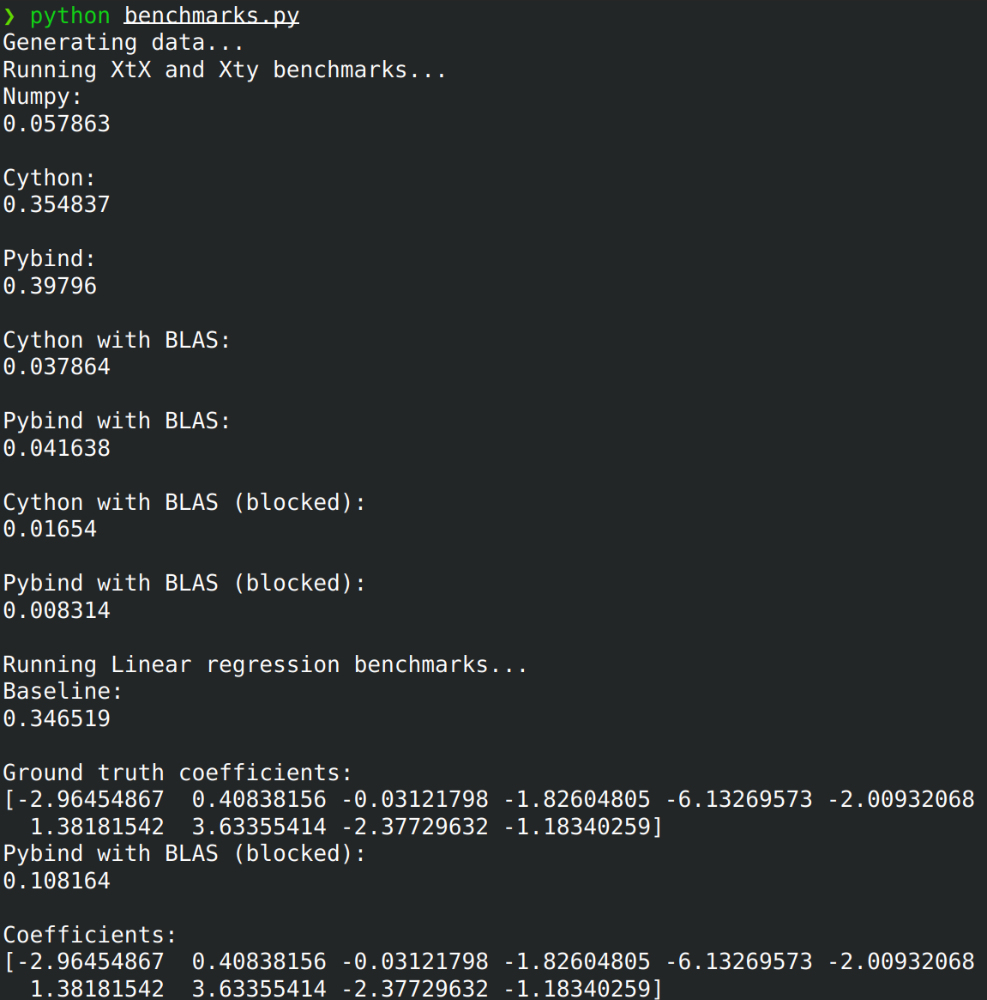

### Description

This repository contains the materials for tutorial 
proposal. Some of the provided code is intentionally
removed, allowing tutorial attendees to implement 
missing parts and learn how to use functions written in 
Cython and C++ within their Python libraries.

- `utils.py` - contains implementation of python baselines and auxilarity functions
- `utils_cython.pyx` - contains naive implementation of $X^tX$ and $X^ty$ functions in Cython and dispatcher between different implementations in Cython
- `utils_pybind.cpp` - contains naive implementation of $X^tX$ and $X^ty$ functions and dispatcher between other different implementations in C++
- `benchmarks.py` - contains benchmarks to compare performance of different methods
- `setup.py` - script used to build the modules
- `solutions/` - folder containing solutions to tutorial and implementations of helper functions. Files there should not be modified and should be used for reference only. **Please don't look to solutions before the end of respective practice session not to spoil the fun!**

### Slides

[Link to slides](https://drive.google.com/file/d/1HVuoC2fWIDjcU7V1G7Kw7mGnn1GGIsn6/view?usp=sharing)

### Setup Instructions

1) Install conda/mamba through the [miniforge installer](https://github.com/conda-forge/miniforge):

    * Windows:
    ```shell
    start /wait "" Miniforge3-Windows-x86_64.exe /InstallationType=JustMe /RegisterPython=0 /S /D=%UserProfile%\Miniforge3
    ```

    Source conda:
    ```shell
    Miniforge3\Scripts\activate.bat
    ```

    * Linux and macOS:
    ```shell
    curl -L -O "https://github.com/conda-forge/miniforge/releases/latest/download/Miniforge3-$(uname)-$(uname -m).sh"
    ```

    Source conda (e.g. like this in bash, use other scripts for other shells like zsh):
    ```shell
    eval "$(miniforge3/bin/conda shell.bash hook)"
    ```


2) Create an environment with Python, compiler toolchain, and PyData stack:

```shell
conda create -n linreg_env -c conda-forge python numpy scipy cython pybind11 setuptools scikit-learn threadpoolctl cxx-compiler

```

Activate environment:

```shell
conda activate linreg_env
```

3) Build the extension modules for this tutorial

```
python setup.py build_ext --inplace --force
```

4) Set the environment variable `PRACTICE_NUM` with correct practice session number

On Linux/MacOS:

```
export PRACTICE_NUM=1
```

On Windows:

```
set PRACTICE_NUM=1
```

5) Runtime benchmarks

```
python benchmarks.py
```

6) You can also run the tests for your functions using

```
python tests.py
```

#### Example:




