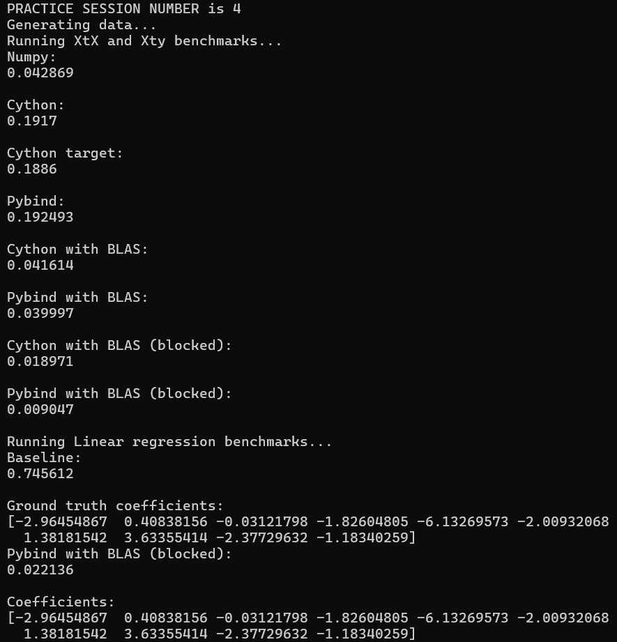

### Description

This repository contains the materials for tutorial 
proposal. Some of the provided code will be intentionally
removed, allowing tutorial attendees to implement 
missing parts and learn how to use functions written in 
Cython and C++ within their Python libraries.

- `utils.py` - contains implementation of python baselines and auxilarity functions
- `utils_cython.pyx` - contains implementation of $X^tX$ and $X^ty$ functions in Cython
- `utils_pybind.cpp` - contains implementations of $X^tX$ and $X^ty$ functions with and without OpenBLAS library usage
- `benchmarks.py` - contains benchmarks to compare performance of different methods
- `setup.py` - script used to build the modules

### Setup Instructions

1) Install any c++ compiler (for example, g++)

```
sudo apt update
sudo apt install g++
```

2) Install OpenBLAS library

```
sudo apt update
sudo apt install libopenblas-dev
```

3) Install Python dependencies

```
pip install numpy scikit-learn Cython setuptools pybind11 
```

4) Build the library

```
python setup.py build_ext --inplace
```

5) Runtime benchmarks

```
python benchmarks.py
```

#### Example:


